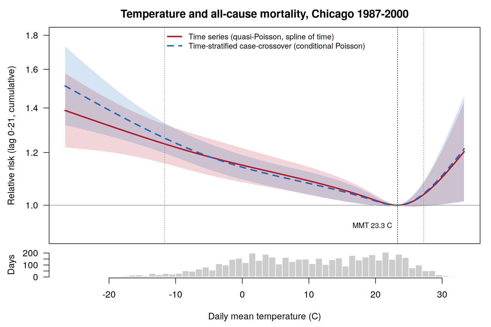
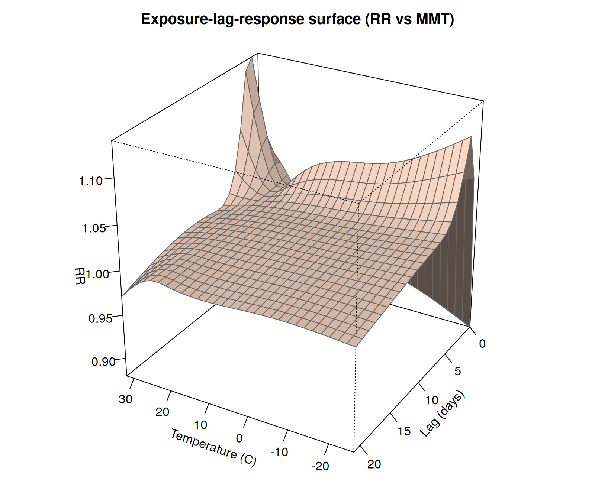
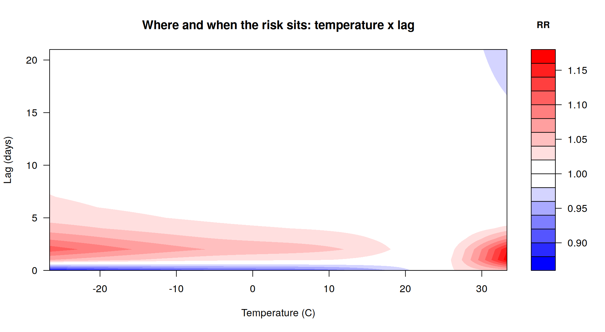
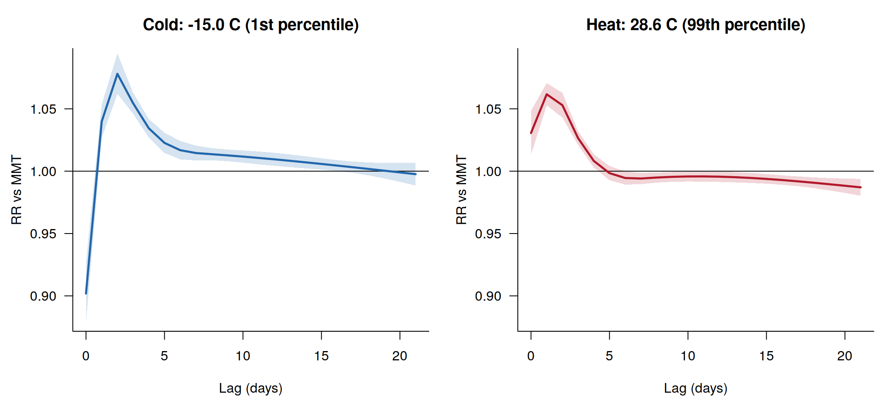
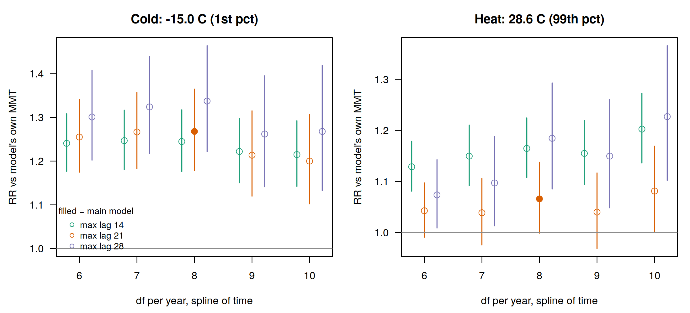
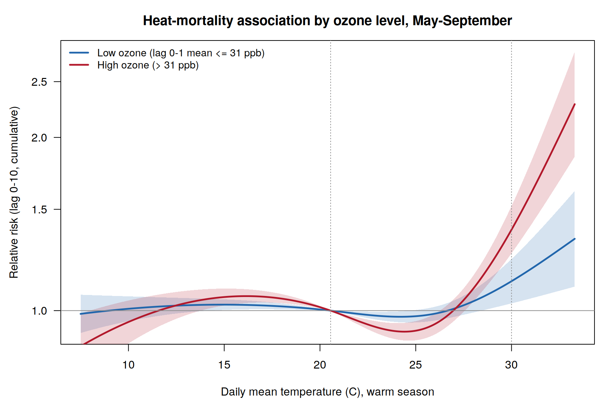

Temperature and mortality in Chicago, 1987-2000: a DLNM and
case-crossover demonstration
================
Raymond Reuel Wayesu
18 September 2026

- [1. Question](#1-question)
- [2. Data](#2-data)
- [3. Methods](#3-methods)
- [4. Results](#4-results)
- [5. Limitations](#5-limitations)
- [6. References](#6-references)
- [7. Session](#7-session)

> **What this is.** A small, fully reproducible methods demonstration on
> an open teaching dataset. It reproduces the standard
> environmental-epidemiology toolkit for short-term temperature effects.
> It is **not** original research, makes no new scientific claim, and
> uses no restricted, clinical or HeatShield user data.

## 1. Question

How does daily mean temperature relate to all-cause mortality over the
following three weeks, where is the temperature of minimum mortality,
how much of the death toll is attributable to cold and to heat, and does
the answer depend on the study design or on defensible modelling
choices?

## 2. Data

`chicagoNMMAPS`, distributed with the **dlnm** R package (GPL \>= 2):
5,114 consecutive days, 1987-01-01 to 2000-12-31, 590,252 deaths. The
data are loaded from the package at run time and are not stored in this
repository.

| variable               | n_missing |  mean |    0% |    1% |   25% |   50% |   75% |   99% |  100% |
|:-----------------------|----------:|------:|------:|------:|------:|------:|------:|------:|------:|
| All-cause deaths / day |         0 | 115.4 |  69.0 |  85.1 | 105.0 | 114.0 | 124.0 | 154.0 | 411.0 |
| Mean temperature (C)   |         0 |  10.1 | -26.7 | -15.0 |   1.7 |  10.6 |  19.4 |  28.6 |  33.3 |
| Ozone (ppb)            |         0 |  20.1 |  -0.8 |   4.1 |  12.0 |  19.0 |  26.6 |  50.0 |  65.8 |
| PM10 (ug/m3)           |       251 |  33.7 |  -3.0 |   4.4 |  20.8 |  30.3 |  42.4 |  93.5 | 356.2 |
| Relative humidity (%)  |      1096 |  69.2 |  25.6 |  34.9 |  58.1 |  69.8 |  80.4 |  98.5 | 100.0 |

Table 1. Daily series: missing values, mean and percentiles.

## 3. Methods

**Exposure-lag-response.** A distributed lag non-linear model
(Gasparrini et al. 2010; Gasparrini 2011). The cross-basis combines a
natural cubic spline of temperature (knots at the 10th, 75th, 90th
percentiles) with a natural cubic spline over lags 0-21 days (3 knots
equally spaced on the log scale).

**Design 1: time series.** Quasi-Poisson regression with a natural
spline of time (8 df per year) and day of week.

**Design 2: time-stratified case-crossover.** Conditional quasi-Poisson
regression with strata of year x month x day of week (1176 strata),
which is equivalent to the conditional-logistic case-crossover analysis
but allows overdispersion (Armstrong et al. 2014). The cross-basis is
identical, so differences between designs reflect the design alone.

**Minimum mortality temperature (MMT).** Minimum of the overall
cumulative curve, searched between the 1st and 99th temperature
percentiles; empirical CI from 1,000 Monte Carlo draws of the
coefficients.

**Attributable burden.** Backward-perspective attributable fraction and
number (Gasparrini & Leone 2014) relative to the MMT, with empirical
CIs. The estimator was written independently for this project and
reproduces the authors’ reference function `attrdl()` to machine
precision (`R/99_validate_attributable.R`).

**Sensitivity.** 5 x 3 grid of df per year and maximum lag, all fitted
to identical rows and compared by QAIC.

**Interaction.** Warm season only (May-September). The heat DLNM (lag
0-10) is allowed to differ between low- and high-ozone days; interaction
is reported on the multiplicative scale and on the additive scale
(RERI), with Monte Carlo CIs from the joint coefficient distribution.

All modelling choices live in `R/00_config.R`. The main specification
was fixed **a priori**, following common practice in multi-city studies
(Gasparrini et al. 2015), not selected by QAIC.

## 4. Results

### 4.1 Overall association and the two designs

The MMT was **23.3 C** (95% eCI 21.7 to 26.2), the 88th percentile of
the temperature distribution. Overdispersion was modest (dispersion
1.19). Relative to the MMT, the cumulative RR was 1.27 (95% CI 1.18 to
1.36) at the 1st percentile and 1.07 (95% CI 1.00 to 1.14) at the 99th.
The case-crossover design gave 1.31 (95% CI 1.23 to 1.39) and 1.07 (95%
CI 1.00 to 1.15).

| percentile | temperature | time_series       | case_crossover    |
|:-----------|------------:|:------------------|:------------------|
| cold_1     |       -15.0 | 1.27 (1.18, 1.36) | 1.31 (1.23, 1.39) |
| cold_2.5   |       -11.7 | 1.24 (1.16, 1.32) | 1.26 (1.20, 1.33) |
| heat_97.5  |        27.2 | 1.04 (1.00, 1.08) | 1.04 (1.00, 1.09) |
| heat_99    |        28.6 | 1.07 (1.00, 1.14) | 1.07 (1.00, 1.15) |

Table 2. Overall cumulative RR (95% CI) versus the time-series MMT, by
design.

### 4.2 Where and when the risk sits

Cold effects are delayed and persistent; heat effects are immediate and
followed by a period of RR below 1, the signature of short-term
mortality displacement (“harvesting”).

### 4.3 Attributable burden

Non-optimal temperature accounted for 8.26% (95% eCI 5.05 to 11.80) of
deaths: 7.99% (95% eCI 4.60 to 11.36) from cold and 0.28% (95% eCI -0.01
to 0.56) from heat. Most of the burden came from *moderate* cold, not
from extreme days.

| component                           | attributable_fraction_pct | attributable_deaths     |
|:------------------------------------|:--------------------------|:------------------------|
| Total (all non-optimal temperature) | 8.26 (5.05, 11.80)        | 48,565 (29,697, 69,330) |
| Cold (below MMT)                    | 7.99 (4.60, 11.36)        | 46,929 (27,006, 66,746) |
| Heat (above MMT)                    | 0.28 (-0.01, 0.56)        | 1,645 (-31, 3,272)      |
| Extreme cold (below 2.5th pct)      | 0.63 (0.45, 0.83)         | 3,698 (2,642, 4,896)    |
| Moderate cold                       | 7.43 (4.12, 10.73)        | 43,648 (24,226, 63,041) |
| Moderate heat                       | 0.09 (-0.03, 0.21)        | 517 (-197, 1,209)       |
| Extreme heat (above 97.5th pct)     | 0.21 (0.03, 0.38)         | 1,211 (155, 2,240)      |

Table 3. Attributable fraction (%) and deaths, with empirical 95% CIs.

### 4.4 Sensitivity

| df_per_year | max_lag | delta_QAIC |  MMT | RR_cold_1st_pct   | RR_heat_99th_pct  | main_model |
|------------:|--------:|-----------:|-----:|:------------------|:------------------|:-----------|
|           6 |      14 |      154.4 | 23.1 | 1.24 (1.18, 1.31) | 1.13 (1.08, 1.18) |            |
|           7 |      14 |      126.5 | 23.1 | 1.25 (1.18, 1.32) | 1.15 (1.09, 1.21) |            |
|           8 |      14 |       69.5 | 22.9 | 1.24 (1.18, 1.32) | 1.16 (1.11, 1.22) |            |
|           9 |      14 |       42.8 | 22.9 | 1.22 (1.15, 1.30) | 1.16 (1.09, 1.22) |            |
|          10 |      14 |       14.1 | 22.9 | 1.21 (1.14, 1.29) | 1.20 (1.14, 1.27) |            |
|           6 |      21 |      117.8 | 23.6 | 1.26 (1.17, 1.34) | 1.04 (0.99, 1.10) |            |
|           7 |      21 |       95.5 | 23.9 | 1.27 (1.18, 1.36) | 1.04 (0.98, 1.11) |            |
|           8 |      21 |       48.6 | 23.3 | 1.27 (1.18, 1.36) | 1.07 (1.00, 1.14) | \<-        |
|           9 |      21 |       21.3 | 23.3 | 1.21 (1.12, 1.31) | 1.04 (0.97, 1.12) |            |
|          10 |      21 |        0.0 | 23.3 | 1.20 (1.10, 1.31) | 1.08 (1.00, 1.17) |            |
|           6 |      28 |      134.6 | 22.8 | 1.30 (1.20, 1.41) | 1.07 (1.01, 1.14) |            |
|           7 |      28 |      112.3 | 23.0 | 1.32 (1.22, 1.44) | 1.10 (1.01, 1.19) |            |
|           8 |      28 |       56.5 | 22.4 | 1.34 (1.22, 1.46) | 1.18 (1.09, 1.29) |            |
|           9 |      28 |       33.3 | 22.2 | 1.26 (1.14, 1.40) | 1.15 (1.05, 1.26) |            |
|          10 |      28 |       11.9 | 22.6 | 1.27 (1.13, 1.42) | 1.23 (1.10, 1.37) |            |

Table 4. Sensitivity grid. Delta-QAIC is relative to the best-fitting
model.

Two honest observations. First, QAIC was lowest at 10 df per year and
lag 21, the edge of the df grid: QAIC keeps rewarding tighter seasonal
control, which is why the main specification was fixed beforehand.
Second, the cold estimate is stable across the grid (RR 1.20 to 1.34),
whereas the heat estimate is not (RR 1.04 to 1.23), because the
cumulative heat effect depends on how much of the post-heat deficit the
lag window includes.

### 4.5 Heat x ozone interaction (warm season)

2,142 warm-season days, 536 with high ozone (lag 0-1 mean above 31 ppb).
Heat = 30.0 C, reference = 20.6 C. The two heat surfaces differed (Wald
chi-square 86.0 on 12 df, p \<0.001). The heat RR was 1.12 (95% CI 1.04
to 1.23) on low-ozone days and 1.38 (95% CI 1.26 to 1.52) on high-ozone
days. Multiplicative interaction: 1.23 (95% CI 1.10 to 1.38); RERI: 0.26
(95% CI 0.12 to 0.41).

| measure                    | estimate_95eCI    |
|:---------------------------|:------------------|
| RR10_heat_lowO3            | 1.12 (1.04, 1.23) |
| RR01_ref_highO3            | 1.01 (0.98, 1.03) |
| RR11_heat_highO3           | 1.39 (1.27, 1.52) |
| RR_heat_within_highO3      | 1.38 (1.26, 1.52) |
| multiplicative_interaction | 1.23 (1.10, 1.38) |
| RERI                       | 0.26 (0.12, 0.41) |

Table 5. Joint effects and interaction measures, with empirical 95% CIs.

## 5. Limitations

- One city, 1987-2000, all-cause mortality: a teaching dataset, not a
  current population.
- Heat estimates lean heavily on the July 1995 heat wave (the series
  maximum, 411 deaths on 1995-07-15), which also coincided with high
  ozone.
- Exposure is a single city-wide daily mean (ecological); individual
  exposure is unmeasured.
- Dry-bulb temperature only. Humidity-inclusive indices (WBGT, UTCI) may
  describe heat strain better; that is what the HeatShield Agri
  forecasting layer computes, and comparing them is a natural next step.
- No control for influenza epidemics or PM10 (251 missing days);
  relative humidity not modelled.
- The MMT is estimated with real uncertainty, and every RR and
  attributable fraction is conditional on it.
- In this dataset ozone and PM10 are approximate reconstructions of the
  original series (see `data/README.md`). The interaction analysis also
  dichotomises ozone and takes ozone status on the day of death while
  heat is cumulated over lags. It illustrates the method; it is not a
  causal estimate.

## 6. References

1.  Gasparrini A, Armstrong B, Kenward MG. Distributed lag non-linear
    models. *Stat Med* 2010;29:2224-34. <doi:10.1002/sim.3940>
2.  Gasparrini A. Distributed lag linear and non-linear models in R: the
    package dlnm. *J Stat Softw* 2011;43(8):1-20.
    <doi:10.18637/jss.v043.i08>
3.  Armstrong BG, Gasparrini A, Tobias A. Conditional Poisson models: a
    flexible alternative to conditional logistic case cross-over
    analysis. *BMC Med Res Methodol* 2014;14:122.
    <doi:10.1186/1471-2288-14-122>
4.  Gasparrini A, Leone M. Attributable risk from distributed lag
    models. *BMC Med Res Methodol* 2014;14:55.
    <doi:10.1186/1471-2288-14-55>
5.  Gasparrini A, Guo Y, Hashizume M, et al. Mortality risk attributable
    to high and low ambient temperature: a multicountry observational
    study. *Lancet* 2015;386:369-75. <doi:10.1016/S0140-6736(14)62114-0>
6.  Bhaskaran K, Gasparrini A, Hajat S, Smeeth L, Armstrong B. Time
    series regression studies in environmental epidemiology. *Int J
    Epidemiol* 2013;42:1187-95. <doi:10.1093/ije/dyt092>

## 7. Session

    ## R version 4.3.3 (2024-02-29)

    ## dlnm     2.4.7
    ## gnm      1.1.5
    ## MASS     7.3.60.0.1
    ## tsModel  0.6.2
