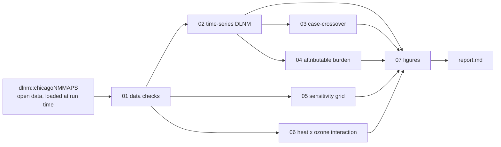

# Temperature and mortality: a DLNM and case-crossover demonstration

**HeatShield Agri's epidemiological evidence layer.** The rest of this repository *forecasts heat
exposure* (WBGT, ISO 7243). This folder shows the other half of the problem: how an
exposure-response relationship between temperature and a health outcome is estimated, with the
methods that are standard in environmental epidemiology.

**Results: [`report/report.md`](report/report.md)**


## What it does

| Step | Script | Method |
|---|---|---|
| 1 | `R/01_data.R` | Load and check the open dataset; descriptive table |
| 2 | `R/02_timeseries_dlnm.R` | Distributed lag non-linear model (lag 0-21), quasi-Poisson time series; minimum mortality temperature with empirical CI |
| 3 | `R/03_casecrossover.R` | Same cross-basis in a time-stratified case-crossover design (conditional Poisson, `gnm`) |
| 4 | `R/04_attributable.R` | Attributable fraction and deaths: total, cold, heat, moderate, extreme |
| 5 | `R/05_sensitivity.R` | df per year x maximum lag grid, compared by QAIC on identical rows |
| 6 | `R/06_interaction.R` | Heat x ozone interaction on the multiplicative and additive (RERI) scales |
| 7 | `R/07_figures.R` | All figures |
| - | `report/report.Rmd` | Report; every number is read from the saved outputs |

Every modelling choice is in one file, [`R/00_config.R`](R/00_config.R).



## What it is not

This is a **methods demonstration on a teaching dataset**, not original research. It makes no new
scientific claim. It uses **no** restricted data: no DHIS2/HMIS data, no clinical or trial data,
and no HeatShield user data.

## Data

`chicagoNMMAPS` ships with the [dlnm](https://cran.r-project.org/package=dlnm) R package
(GPL >= 2): daily all-cause mortality, weather and air pollution for Chicago, 1987-2000. It is
loaded from the package when the scripts run. **No data file is committed here.**
See [`data/README.md`](data/README.md).

## Run it

Needs R >= 4.4 (required by the current dlnm release) and pandoc (bundled with RStudio).

```r
install.packages(c("dlnm", "gnm", "tsModel", "rmarkdown"))
```

```bash
cd dlnm/temperature-mortality-dlnm
Rscript run_all.R        # about one minute; writes outputs/ and report/report.md
```

In RStudio, open `temperature-mortality-dlnm.Rproj` and run `source("run_all.R")`.

To pin package versions, run `Rscript R/make_renv_lock.R` once and commit the
`renv.lock` it writes. CI then restores those exact versions automatically; with
no lockfile present it installs the current CRAN releases instead. No lockfile is
committed here, because a valid one has to be produced by `renv::snapshot()` on a
working installation so that every version and hash is real.

Optional check that the attributable-fraction code matches the method authors' reference
function (downloaded to a temporary file, never stored here):

```bash
Rscript R/99_validate_attributable.R
```

## Layout

```
dlnm/temperature-mortality-dlnm/
|-- README.md
|-- LICENSE                    MIT (code only; data licences listed separately)
|-- run_all.R                  one command reproduces everything
|-- temperature-mortality-dlnm.Rproj
|-- CITATION.cff
|-- R/
|   |-- 00_config.R            all analysis choices
|   |-- 00_functions.R         cross-basis, MMT, QAIC, attributable burden
|   |-- 01_data.R ... 07_figures.R
|   |-- 99_validate_attributable.R
|   `-- make_renv_lock.R       run once to pin package versions
|-- data/README.md             provenance and licence; no data files
|-- data-raw/
|   `-- make_synthetic_dhs.R   Tier 2: synthetic DHS stand-in (git-ignored output)
|-- outputs/
|   |-- figures/               committed (the report links to them)
|   `-- tables/                committed CSVs
`-- report/
    |-- report.Rmd
    `-- report.md              rendered; GitHub displays it directly
```

Continuous integration: [`.github/workflows/dlnm-demo.yml`](../../.github/workflows/dlnm-demo.yml)
at the **repository root** (GitHub Actions only discovers workflows there) re-runs the whole
pipeline whenever this folder changes.

## Methods references

1. Gasparrini A, Armstrong B, Kenward MG. Distributed lag non-linear models. *Stat Med* 2010;29:2224-34.
2. Gasparrini A. Distributed lag linear and non-linear models in R: the package dlnm. *J Stat Softw* 2011;43(8):1-20.
3. Armstrong BG, Gasparrini A, Tobias A. Conditional Poisson models: a flexible alternative to conditional logistic case cross-over analysis. *BMC Med Res Methodol* 2014;14:122.
4. Gasparrini A, Leone M. Attributable risk from distributed lag models. *BMC Med Res Methodol* 2014;14:55.
5. Gasparrini A, et al. Mortality risk attributable to high and low ambient temperature: a multicountry observational study. *Lancet* 2015;386:369-75.

## Licence

Code: [MIT](LICENSE). Data: not redistributed. `chicagoNMMAPS` is loaded at run time from the
dlnm package (GPL >= 2); `attrdl.R` is downloaded to a temporary file when the optional
validation script runs and is never stored here; Tier-2 DHS data are synthetic only. Details in
[`LICENSE`](LICENSE) and [`data/README.md`](data/README.md).
